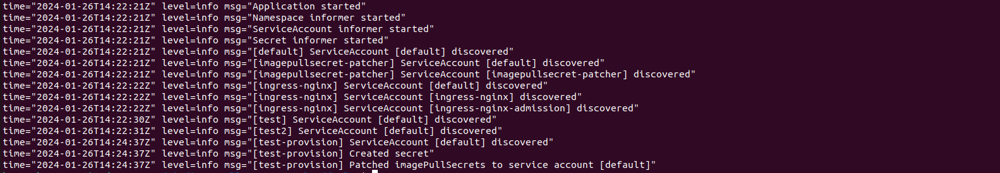

# imagepullsecret-patcher

[](https://travis-ci.org/JanSvoboda/imagepullsecret-patcher)
[](https://goreportcard.com/report/github.com/JanSvoboda/imagepullsecret-patcher)


A simple Kubernetes [client-go](https://github.com/kubernetes/client-go) application that creates and patches imagePullSecrets to service accounts in all Kubernetes namespaces to allow cluster-wide authenticated access to private container registry.

By default application uses [informers](https://pkg.go.dev/k8s.io/client-go/informers) to monitor changes in namespaces, secrets and service accounts. Upon status change, eg creation of new namespace, the secret is created in the new namespace and default service account is patched.




Original blog post: https://medium.com/titansoft-engineering/kubernetes-cluster-wide-access-to-private-container-registry-with-imagepullsecret-patcher-b8b8fb79f7e5 however it doesn't reflect fully upon latest imporovements.

## Installation and configuration

To install imagepullsecret-patcher, a helm chart in [deploy](deploy) directory is created. Check README on how to quickly install it in cluster.

Compiled binary can be configured to run locally and connect to kubernetes cluster based on configuration present in ${HOME}/.kube/config.

Below is a table of available configurations:

| Config name          | ENV                         | Command flag          | Default value          | Description                                                                                                                                                  |
| -------------------- | --------------------------- | --------------------- | -----------------------| -------------------------------------------------------------------------------------------------------------------------------------------------------------|
| force                | CONFIG_FORCE                | -force                | true                   | overwrite secrets when not match                                                                                                                             |
| debug                | CONFIG_DEBUG                | -debug                | false                  | show DEBUG logs                                                                                                                                              |
| managedonly          | CONFIG_MANAGEDONLY          | -managedonly          | false                  | only modify secrets which were created by imagepullsecret                                                                                                    |
| runonce              | CONFIG_RUNONCE              | -runonce              | false                  | run the update loop once, allowing for cronjob scheduling if desired                                                                                         |
| serviceaccounts      | CONFIG_SERVICEACCOUNTS      | -serviceaccounts      | "default"              | comma-separated list of serviceaccounts to patch                                                                                                             |
| all service account  | CONFIG_ALLSERVICEACCOUNT    | -allserviceaccount    | false                  | if true, list and patch all service accounts and the `-servicesaccounts` argument is ignored                                                                 |
| dockerconfigjson     | CONFIG_DOCKERCONFIGJSON     | -dockerconfigjson     | ""                     | json credential for authenticating container registry                                                                                                        |
| dockerconfigjsonpath | CONFIG_DOCKERCONFIGJSONPATH | -dockerconfigjsonpath | ""                     | path for mounted json credentials for dynamic secret management                                                                                              |
| secret name          | CONFIG_SECRETNAME           | -secretname           | "image-pull-secret"    | name of managed secrets                                                                                                                                      |
| excluded namespaces  | CONFIG_EXCLUDED_NAMESPACES  | -excluded-namespaces  | ""                     | comma-separated namespaces excluded from processing                                                                                                          |
| loop duration        | CONFIG_LOOP_DURATION        | -loop-duration        | 10 seconds             | duration string which defines how often namespaces are checked, see https://golang.org/pkg/time/#ParseDuration for more examples                             |
| use informers        | CONFIG_USE_INFORMERS        | -use-informers        | true                   | if true application will not be running in loop periodically, but will use informers to catch events about k8s resource changes to apply changes dynamically |
| running in cluster   | CONFIG_RUNNING_IN_CLUSTER   | -running-in-cluster   | true                   | if false application will check ${HOME}/.kube/config to build configs from kubeconfig file, ie application can be run locally for development             |
| secret namespace     | CONFIG_SECRET_NAMESPACE     | -secretnamespace      | imagepullsecret-patcher| namespace where original secret can be found                                                                                                                 |

And here are the annotations available:

| Annotation                                        | Object    | Description                                                                                                       |
| ------------------------------------------------- | --------- | ----------------------------------------------------------------------------------------------------------------- |
| k8s.titansoft.com/imagepullsecret-patcher-exclude | namespace | If a namespace is set this annotation with "true", it will be excluded from processing by imagepullsecret-patcher. |

## Providing credentials

You can provide the authentication credentials for imagepullsecret to populate across namespaces in a couple of ways.

You can provide a raw secret as an environment variable, or better yet, by mounting a volume into the container. Mounted secrets can be dynamically updated and are more secure. Please see the relevant docs for more information https://kubernetes.io/docs/concepts/configuration/secret/. If you use helm chart present in [deploy](deploy) folder a secret will be created within the same namespace where iamgepullsecret-patcher is installed.

## Why

To deploy private images to Kubernetes, we need to provide the credential to the private docker registries in either

- Pod definition (https://kubernetes.io/docs/concepts/containers/images/#specifying-imagepullsecrets-on-a-pod)
- Default service account in a namespace (https://kubernetes.io/docs/tasks/configure-pod-container/configure-service-account/#add-imagepullsecrets-to-a-service-account)

With the second approach, a Kubernetes cluster admin configures the default service accounts in each namespace, and a Pod deployed by developers automatically inherits the image-pull-secret from the default service account in Pod's namespace.

This is done manually by following command for each Kubernetes namespace.

```
kubectl create secret docker-registry image-pull-secret \
  -n <your-namespace> \
  --docker-server=<your-registry-server> \
  --docker-username=<your-name> \
  --docker-password=<your-pword> \
  --docker-email=<your-email>

kubectl patch serviceaccount default \
  -p "{\"imagePullSecrets\": [{\"name\": \"image-pull-secret\"}]}" \
  -n <your-namespace>
```

And it could be automated with a simple program like imagepullsecret-patcher.

## Contribute

Development Environment

- Go 1.21
